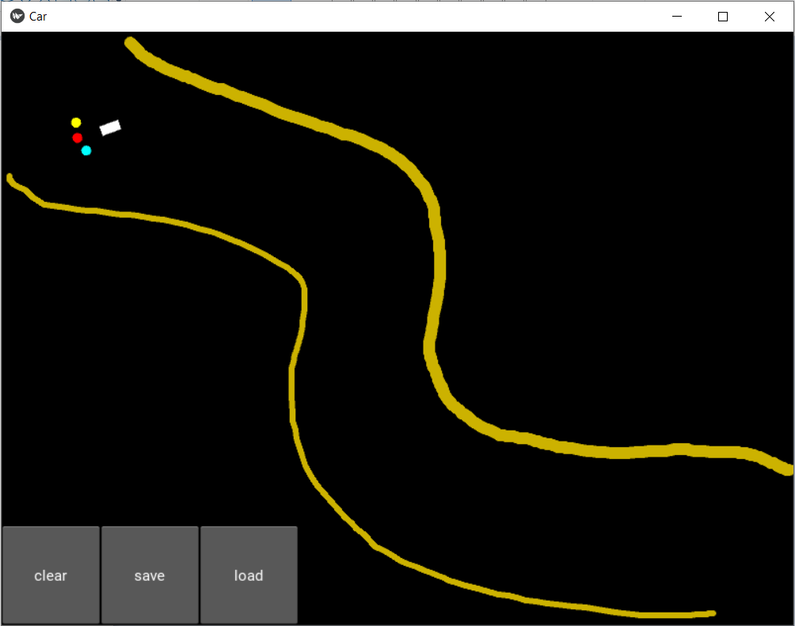
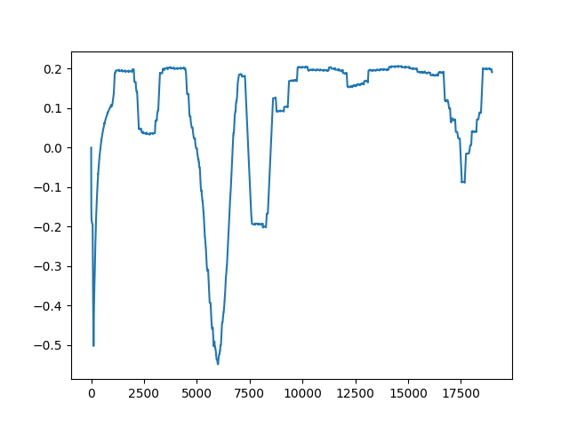

Self Driving car using Deep Q-Learn from PyTorch 1.8.1+cpu
Map and Car GUI developed using Kivy 2.0.0 based on model provided
by course Artificial Intelligence A-Z

Requirements:
Python 3.9.4
PyTorch 1.8.1+cpu
Kivy 2.0.0
matplotlib
numpy

AI model developed with PyTorch version 1.8.1+cpu
Neural Network with 4 layers (two intermediate layers with 30 neurons each)
- 5 inputs: car sensors 1 to 3, orientation and -orientation (using  -orientation
get better results, need more analysis to understand why)

- 3 outputs (as actions in code): keep direction, turn 20 deg, turn -20 deg
The initial goal is the left upper corner. Once the car reaches it, the
goal turns to the right lower corner. Once the car reaches the goal, it
changes back to the left upper corner.

Rewards:
reaching goal = 2
moving closer to the goal = 0.2
moving away from the goal = -0.2
riding in the sand = -1
hitting the edges = -1

Run car.py, draw "sand" lines as obstacles for the car. Current NN gains can
be saved for future load.

Know issues with kivy: crash when window is resized or maximized

